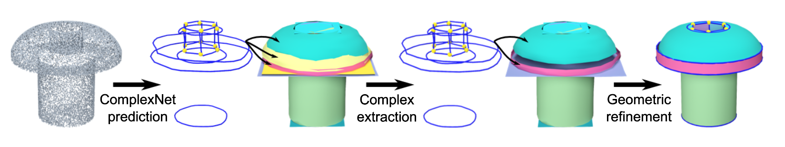
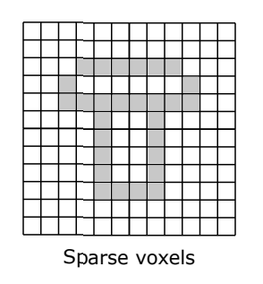
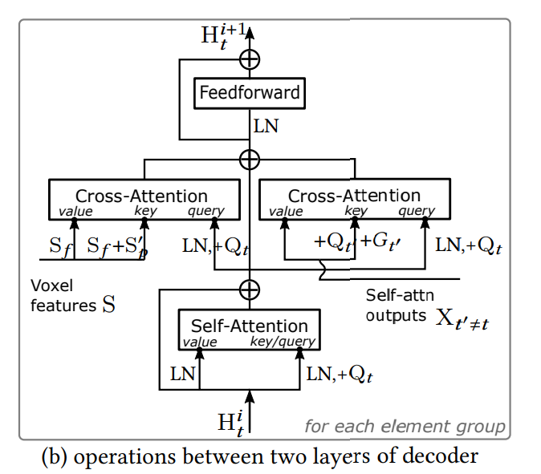
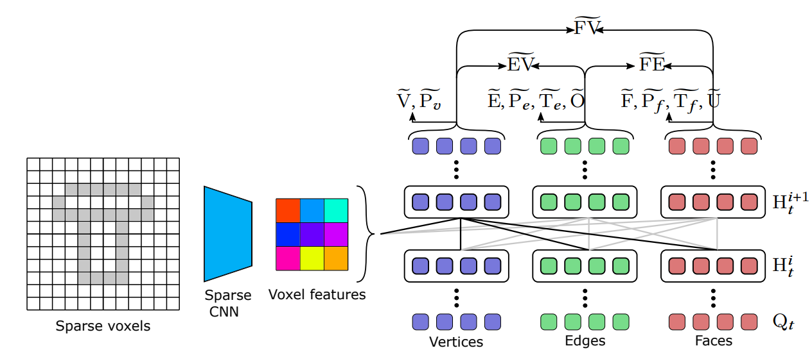

# ComplexGen

## ComplexGen的流水线

1. ComplexGen网络预测：网络将**点云**作为输入进ComplexGen的神经网络内，输出为{点、边、面、边点、面点、面边、嵌入空间}
2. Complex提取：
    1. 去除步骤*1*中冗余的输出
    2. 运用组合优化算法提取Complex结构，以形成BRep流形模型
    3. 输出：合法的BRep流形
3. 几何改良：
    1. 将*2*中输出的*点*和*拓扑邻接关系*作为输入
    2. 通过*拓扑提示*进行正则化，减少输入的点中存在的*噪声*
    3. 由输入的点与拓扑关系，构建BRep模型输出

## 1. 网络

### 输入
网络的输入是*3D点云*及其离散的*体素*

每一块*体素*都是一个边长为单位1的正方体，通过 $128^3$ 个小正方体组成整个模型所在的空间，因此每一个*体素*的数据是 $S_p \in [0, 127]^3$ 的位置坐标，一个模型的数据即为： $S_p \in \mathbb{R}^{S \times 3}$ ，其中 $S$ 为非空体素的数量。

> 图中灰色部分为非空体素

### 网络结构
网络分为两部分，Encoder和Tri-path transformer decoder

1. Encoder(Sparse CNN)：

    1. 将 $128^3$ 的空间网格信息通过卷积与池化操作提取至 $16^3$ 
    2. 提取出每一个**非空体素**Voxel的 $d=384$ 个特征。即输出为 $S_f \in \mathbb{R}^{S \times d}$ (额外信息)

2. Tri-path transformer decoder：
    1. 输入： 
        1.  $S_f$ ：Encoder的输出
        2.  $S^{'}_p$ ：每一个体素的正弦位置编码 $S^{'}_p=PE(S_p)$ ，体素在 $xyz$ 每一个方向上的坐标都被编码为了一个128维的向量，因此位置编码为 $3 \times 128=386$ 维向量。
        3.  $Q_v,Q_e,Q_f$ ：点、边、面经过嵌入层学习到的特征向量
    2. 网络子层：
        decoder网络是由许多一样的子网络所组成的，对于第 $t$ 个子网络
        1. 输入为 $H_t$ 和 $2.1$ 所述的输入
        2. 输出为 $H_{t+1}$
        3. 网络结构：
            
            > 其中 $LN(\cdot)$ 表示线性层， $CA(\cdot)$ 表示交叉注意力层（Cross Attention）， $SA(\cdot)$ 表示自注意力层（Self Attention）
    3. 网络输出：
        对于*点、边、面*三种类型的元素
        1. 某个元素合法性的概率 $F^{val}$
        2. 某个元素属于某个类型的概率（如：边的类型有直线、圆……） $F^{type}$
        3. 某个元素是否开放的概率 $F^{open}$ 
        4. 某个元素在各自类型的嵌入空间的坐标 $P$ 
        5. 某两个不同类型元素之间的邻接关系 $F^{topo}_{fe}, F^{topo}_{ev}, F^{topo}_{fv}$

